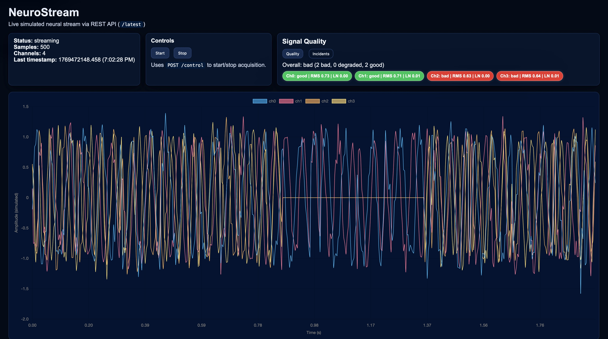
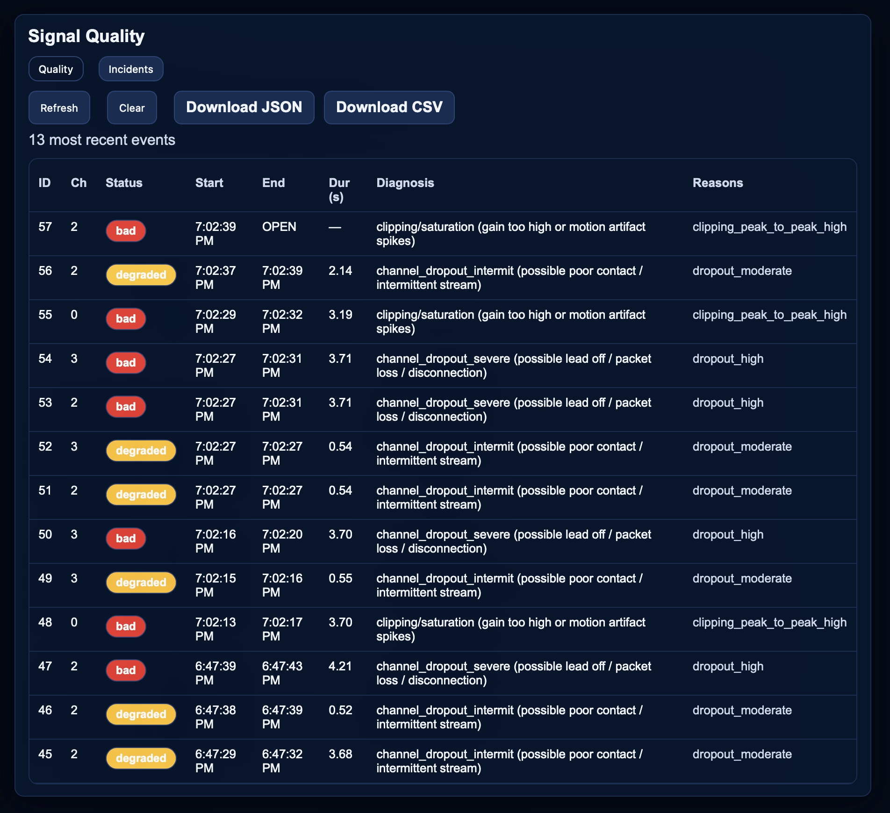

# NeuroStream

Lightweight simulated neural streaming dashboard with per-channel signal quality monitoring and incident logging.

---

## Table of Contents
- [Purpose](#purpose)
- [What You Get](#what-you-get)
- [Architecture](#architecture)
- [Workflow](#workflow)
- [Signal Quality](#signal-quality)
  - [States: good vs degraded vs bad](#states-good-vs-degraded-vs-bad)
  - [Metrics](#metrics)
- [Incident Logging](#incident-logging)
- [API Endpoints](#api-endpoints)
- [How to Run](#how-to-run)
- [Screenshots](#screenshots)
- [Configuration](#configuration)
- [Future Work](#future-work)

---

## Purpose
NeuroStream simulates a multi-channel neural acquisition device and demonstrates how signal quality can be monitored and logged in real time for engineering and research applications.

---

## What You Get
- Live neural signal visualization
- Per-channel quality assessment
- Incident logging with timestamps and diagnosis
- Exportable logs (CSV / JSON)

---

## Architecture
**Backend**
- Flask REST API
- SQLite database for samples and events
- Background monitoring thread

**Frontend**
- Vanilla JavaScript
- Chart.js for plotting
- Tab-based interface for quality and incidents

---

## Workflow
1. Simulator generates neural samples.
2. Samples stored in SQLite.
3. Quality metrics computed in sliding windows.
4. State transitions logged as incidents.
5. Frontend polls APIs and renders charts and tables.

---

## Signal Quality

### States: good vs degraded vs bad
- **good**: signal within normal limits.
- **degraded**: moderate artifacts detected.
- **bad**: severe dropout, noise, or clipping.

---

### Metrics
- **RMS (Root Mean Square):** overall signal energy.
- **Peak-to-Peak:** amplitude range.
- **Dropout Fraction:** percentage of missing/zero samples.
- **Line Noise Ratio:** proportion of power at 60Hz.

---

## Incident Logging
When a channel enters degraded or bad state:
- start timestamp is recorded
- end timestamp when recovered
- duration computed
- diagnosis inferred from metric thresholds

Stored in SQLite table: `events`.

---

## API Endpoints
- `/health`
- `/latest`
- `/quality`
- `/events`
- `/export/events.csv`
- `/export/events.json`

---

## How to Run

1. From inside the backend folder, install dependencies: 
```bash
pip install -r requirements.txt
```

2. Still inside the backend folder, run app: 
```bash
python app.py
```

3. Open browser:
```
http://127.0.0.1:5000/
```

---

## Screenshots

Signal plot example:


Incident log example:


---

## Configuration
Edit `config.py` to adjust:
- sample rate
- number of channels
- artifact probabilities
- database path

---

## Future Work
- Real hardware integration
- Advanced artifact classifiers
- User annotations
- Long-term trend analytics

